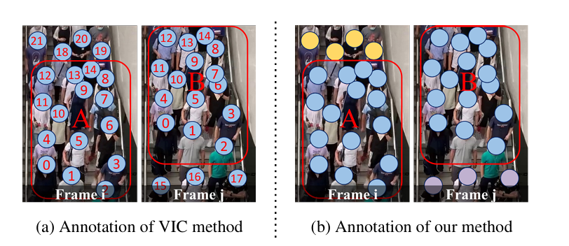
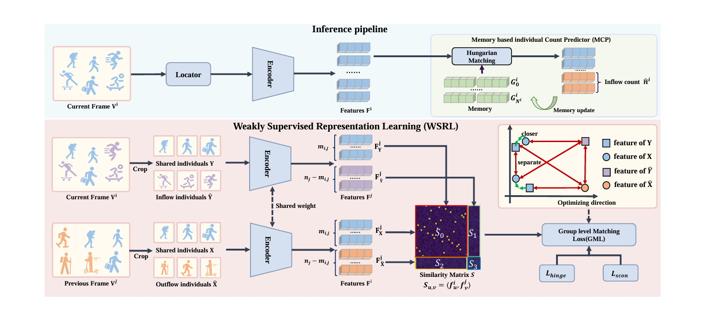

# WVIC
[1]. Liu, Xinyan, Guorong Li, Yuankai Qi, Ziheng Yan, Zhenjun Han, Anton van den Hengel, Ming-Hsuan Yang and Qingming Huang. “Weakly Supervised Video Individual Counting.” 2024 IEEE/CVF Conference on Computer Vision and Pattern Recognition (CVPR) (2023): 19228-19237.

This paper proposed a new task, weakly supervised video individual counting (WVIC), which provide two types of labels rather than trajectory labels. This largely reduces the label cost. And this paper also proposed a baseline for WVIC. Last, this paper extended two datasets and build a UAV dataset.

Video Crowd Counting (VCC) refer to count the number of people in each frame of a video. VCC will over counting people number when people appear in multiple frames. 

So Video Individual Counting (VIC) is proposed which count the total number of people with unique identities appearing in a video.The apparent approach to crowd counting in VIC task is to count the people in the initial frame and add the number of people who come into the camera's field of view in later frames. But this method require trajectory labels which is very expensive.

The WVIC task does not require accurately identify the same people in both frames. It just need to annotate the inflow and outflow people. Thus it reduces annotation costs compared to creating individual pairwise target assosiations for each observed pedestrian between neighboring frames.
   

(a) Existing method requires unique labels to indicate the position of each person in each frame, and these labels are consistent across frames.
(b) weakly supervised method only need two type labels to indicate whether they are an inflow/outflow pedestrian.

The locator is trained independently with the coordinate annotations, and existing image crowd localization networks such as FIDT can be used.The encoder istrained with our Weakly Supervised Representation Learning method (WSRL) to extract the discriminative features
of each individual.

The locator predicts the coordinates for pedestrians. The encoder generates representations for each individual, and MCP predicts inflow counts and updates the individual templates stored in the memory.

