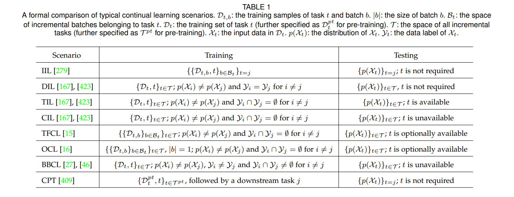

## Abstract
- catastrophic forgetting
- memory stability
- learning plasticity
- generalizability 
- resource efficiency

## Introduction
methods:
- regularization-based approach
- replay-based approach
- optimization-based
- representation-based
- architecture-based

## Basic settings
### Typical Scenario
According to the division of incremental batches and the availability of task identities, we describe continual learning scenarios as follows:

### Evaluation Metric

## Theoretical foundation
