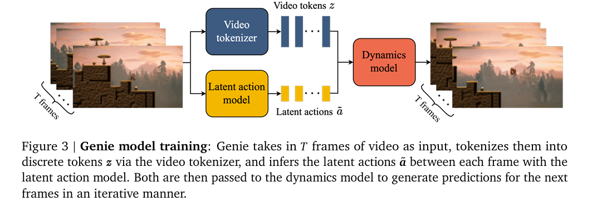
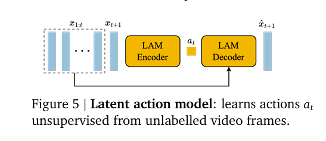
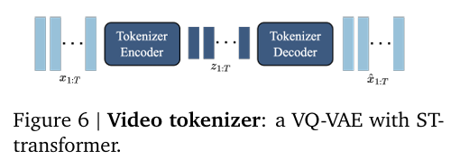
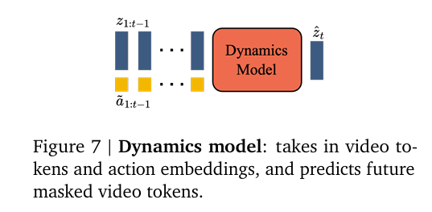
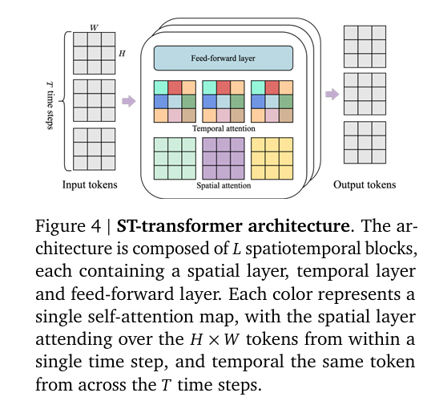

# Week 10
[1]. Bruce, J., Dennis, M.D., Edwards, A., Parker-Holder, J., Shi, Y., Hughes, E., Lai, M., Mavalankar, A., Steigerwald, R., Apps, C., Aytar, Y., Bechtle, S., Behbahani, F.M., Chan, S., Heess, N.M., Gonzalez, L., Osindero, S., Ozair, S., Reed, S., Zhang, J., Zolna, K., Clune, J., Freitas, N.D., Singh, S., & Rocktaschel, T. (2024). Genie: Generative Interactive Environments. ArXiv, abs/2402.15391.

This is a new form of generative AI that can generate a diverse set of interactive and controllable environments despite training from video-only data.

This model contains three key components: a latent action model, a video tokenizer, and a dynamics model. 

**Latent Action Model.** 

To train the model, they leverage a VQ-VAE based objective, which enables they to limit the number of predicted actions to a small discrete set of codes.  

**Video Tokenizer.**  

When they compress videos into discrete tokens they again make use of VQ-VAE.
They also utilize the ST-transformer in both encoder and decoder to incoporate temporal dynamics in the encodings.

**Dynamics Model**  

The dynamics model is a decoder-only MaskGIT transformer. They again utilize an ST-transformer.

