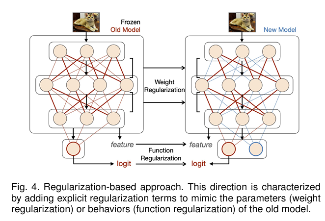
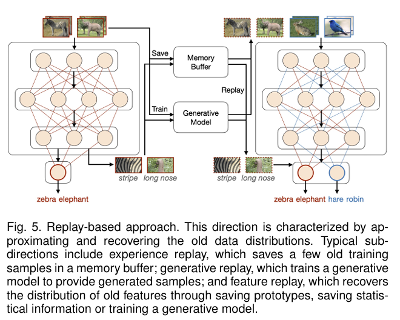
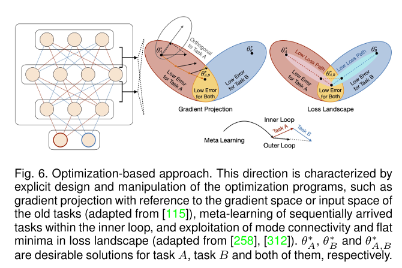
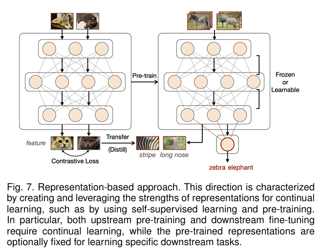
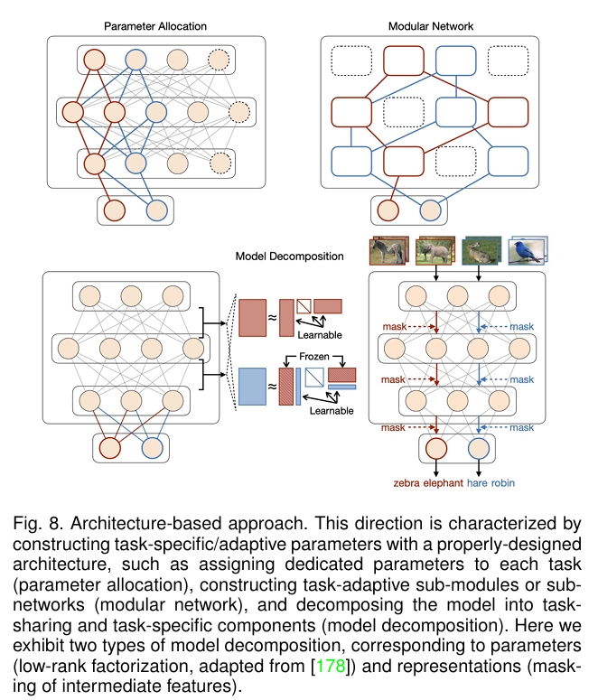

# Week7

This week I read the survey about continual learning's methods.

[1]. Wang, L., Zhang, X., Su, H., & Zhu, J. (2023). A Comprehensive Survey of Continual Learning: Theory, Method and Application. IEEE Transactions on Pattern Analysis and Machine Intelligence, 46, 5362-5383.

## Regularization-Based Approach
This direction is characterized by adding explicit regularization terms to balance the old and new tasks, which usually requires storing a frozen copy of the old model for reference.Depending on the target of regularization, such methods can be divided into two sub-directions.

- The first is **weight regularization**, which selectively regularizes the variation of network parameters. A typical implementation is to add a quadratic penalty in loss function that penalizes the variation of each parameter depending on its contribution or “importance” to performing the old tasks.
- The second is **function regularization**, which targets the intermediate or final output of the prediction function. This strategy typically employs the previously-learned model as the teacher and the currently-trained model as the student,while implementing knowledge distillation (KD) to mitigate catastrophic forgetting.

## Replay-Based Approach
It group the methods for approximating and recovering old data distributions into this category. Depending on the content of replay, these methods can be further divided into three sub-directions.

- The first is **experience replay**, which typically stores a few old training samples within a small memory buffer.
- The second is **generative replay** or pseudo-rehearsal, which usually requires training an additional generative model to replay generated data.
- The third is **feature replay**, which maintains feature-level rather than data-level distributions enjoys numerous benefits in terms of efficiency and privacy.

## Optimization-Based Approach
Continual learning can be achieved by not only adding additional terms to the loss function, but also explicitly designing and manipulating the optimization programs.

- A typical idea is to perform **gradient projection**.
- Another attractive idea is **meta-learning** or learning-to learn for continual learning, which attempts to obtain a
data-driven inductive bias for various scenarios, rather than designing it manually.
- Besides, some other works refine the optimization process from a loss landscape perspective.

## Representation-Based Approach
The approaches that create and exploit the strengths of representations for 
continual learning into this category.
In addition to an earlier work that acquires sparse 
representations from meta-training, recent work has attempted
to incorporate the advantages of self-supervised learning,
and large-scale pre-training to improve the representations
in initialization and in continual learning.

- The first is to implement **self-supervised learning** (basi
cally with contrastive loss) for continual learning.
- The second is to use **pre-training for downstream
continual learning**. Several empirical studies suggest that
downstream continual learning clearly benefits from the use
of pre-training, which brings not only strong knowledge
transfer but also robustness to catastrophic forgetting.
- The third is **continual pre-training** (CPT) or continual
meta-training. As the huge amount of data required for
pre-training is typically collected in an incremental manner,
performing upstream continual learning to improve down
stream performance is particularly important.

## Architecture-Based Approach
Constructing task-specific parameters can explicitly resolve
the problem that shared set of parameters.Previous work generally separates this category into param
eter isolation and dynamic architecture, depending on whether
the network architecture is fixed or not.

- Parameter allocation features an isolated parameter sub
space dedicated to each task throughout the network, where
the architecture can be fixed or dynamic in size.
- Model decomposition separates a model explicitly into
task-sharing and task-specific components, where the task
specific components are often expandable.
- Modular network leverages parallel sub-networks or
sub-modules to learn incremental tasks in a differentiated
manner, without pre-defined task-sharing or task-specific
components.
