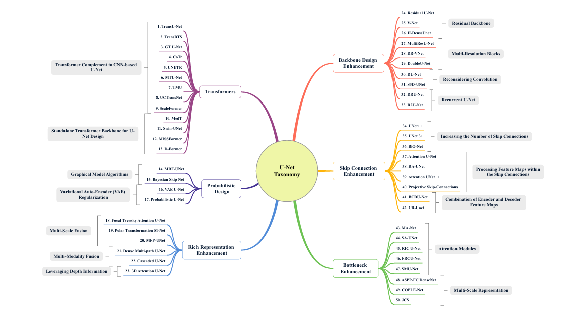
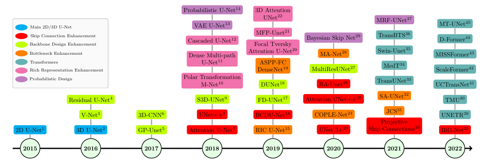
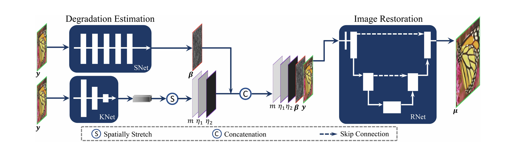

# Week8

[1]. R. Azad et al., "Medical Image Segmentation Review: The Success of U-Net," in IEEE Transactions on Pattern Analysis and Machine Intelligence, doi: 10.1109/TPAMI.2024.3435571.  
[2]. Z. Yue, H. Yong, Q. Zhao, L. Zhang, D. Meng and K. -Y. K. Wong, "Deep Variational Network Toward Blind Image Restoration," in IEEE Transactions on Pattern Analysis and Machine Intelligence, vol. 46, no. 11, pp. 7011-7026, Nov. 2024, doi: 10.1109/TPAMI.2024.3365745.

## Medical Image Segmentation Review: The Success of U-Net

U-Net is the most widespread image segmentation architecture due to its flexibility, optimized modular design, and success in all medical image modalities.

Based on the underlying design idea, the extensions of U-Net could be splited into six categories:
1. Skip Connection Enhancements
2. Backbone Design Enhancements
3. Bottleneck Enhancements
4. Transformers
5. Rich Representation Enhancements
6. Probabilistic Design

## Deep Variational Network Toward Blind Image Restoration

This paper proposed a novel blind image restoration method 
which integrate both the advantages of class model-based methods
and deep learning-based methods. And design a variational inference
algorithm where all the expected posteriori distributions are
parameterized as deep neural networks to increase model capability.
Experiments on two typical blind IR tasks, namely image denoising and
super-resolutino.

